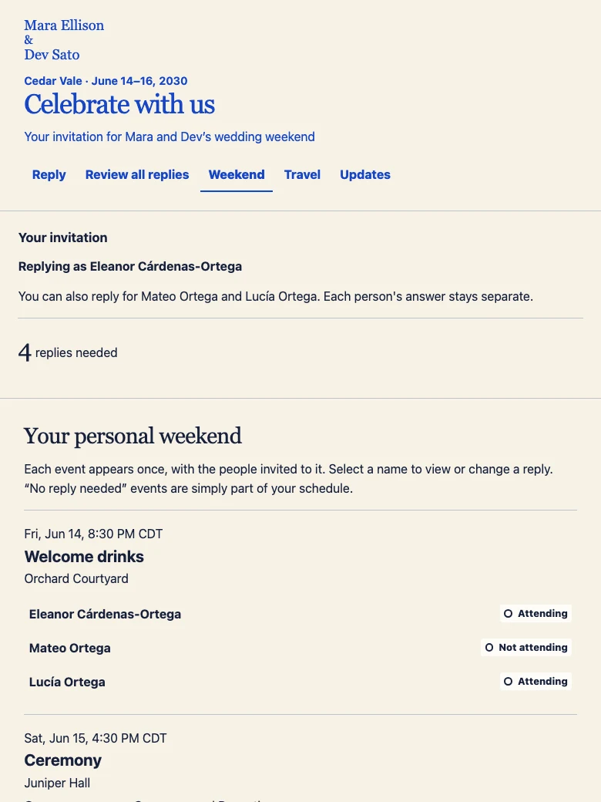

# Gather Here

A wedding-weekend product walkthrough, interactive prototype, and implementation handoff. Start with **one wedding in your own accounts**. Gather Here is a working name.

Explore the [hosted walkthrough](https://gather-here.pages.dev) and [single-wedding setup guide](https://gather-here.pages.dev/setup.html), or give your agent this repository and [start here](docs/AGENT-START.md). The handoff maps the product to SvelteKit, Cloudflare Workers, Supabase, and sign-in email delivery.

**This is not a ready-to-install wedding application.** The current prototype uses fictional people and browser-only state. Durable storage, private sign-in, real email, and the production application remain to be built. Do not enter real guest information.

## Walkthrough

The presentation explains the problem, shows the organizer and guest experiences, provides guided prototype tasks, and describes the next build. The setup guide explains how to own and operate a single wedding without building a service for many couples.

[](site/assets/guest.webp)

## Local preview

Requires Node.js 24 or newer, npm, and Python 3. From a clone of this repository, run:

```bash
npm ci
npm run build
npm run preview
```

Open `http://127.0.0.1:8796`. Stop the preview with Control-C. The static preview needs no cloud account, database, or API key.

Replies stay in the current tab. Style choices stay in the browser. Changing the prototype case or using Reset restores fictional records; the style editor has its own reset. Separate browser sessions do not share real RSVP state.

## Agent handoff

Start with [the agent guide and reusable prompt](docs/AGENT-START.md).

| Document | Use it to |
|---|---|
| [Stack](docs/STACK.md) | Map each feature to a service and distinguish a single wedding from a multi-couple platform |
| [Setup](docs/SETUP.md) | Choose account owners, collect configuration, and build in a safe order |
| [RSVP contract](docs/rsvp-contract.md) | Implement the first durable save, correction, and recovery path |
| [Operations](docs/OPERATIONS.md) | Prepare access, backups, restore, support and post-wedding retirement |
| [Deployment record](DEPLOY.md) | Understand the actual static host and the separate future application target |
| [Business requirements](docs/brd.md) | Understand the problem and evidence limits |
| [Product requirements](docs/prd.md) | Preserve the intended behavior and boundaries |
| [User stories](docs/user-stories.md) | Evaluate the proposed acceptance criteria |

## Checks

Run the inherited state-contract checks:

```bash
npm test
```

For browser checks, keep the local preview running in another terminal, then run:

```bash
npx playwright install chromium
npm run test:e2e
```

These checks cover the fictional model and browser journeys. They do not verify a real database, authentication, mail delivery, backups, or customer acceptance. The durable contract’s P1–P8 obligations remain unrun.

## Structure

```text
site/                    hosted walkthrough and setup guide
prototype/concepts/      selected organizer, guest and style prototype
docs/                    public requirements and implementation handoff
tools/build.mjs          builds only the two public site directories
tests/                   fictional model and browser checks
```

## Source and rights

Private conversations, real guest information, provider credentials, and session evidence are excluded. Imported source hashes are in [provenance](docs/provenance.json). Product screenshots show fictional data and are captured from this repository’s prototype. Regenerate with `tools/capture-previews.mjs` against a running local preview; the capture emits PNG files for conversion to the checked-in WebP format.

The bundled Pinyon Script font retains its [SIL Open Font License](prototype/concepts/assets/fonts/OFL.txt). No source-code license has been selected for this repository.
